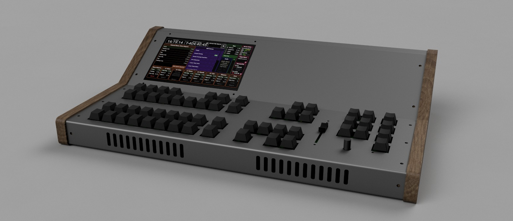
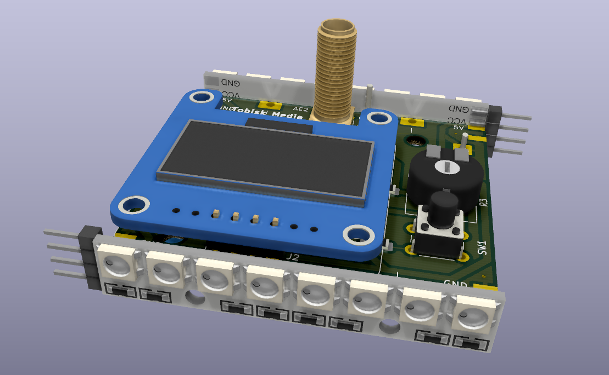
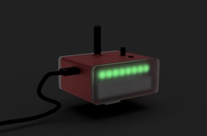

# Tobisk Television Control Panel (ToTeCP)

This Project contains all software and hardware sources necessary to control a setup consisting of:

- ATEM Video Switcher
- OBS for graphics and streaming/recording
- Website based text generator for OBS
- MOTU828es based Audio Mixing
- LoRa Based Camera Tallys and Python based Tally base

The main part of this project is a nodejs based application that provides the control of the infrastructure via macros

## Control desk Software

The main part of this software is the control desk software which is capable of controlling ATEM switchers and OBS. This software is meant to run on a raspberry PI and provides the user interface via a website. there is also a serial interface to and arduino based keyboard interface.

- Main Control Desk Web-App and Server: `/app`
- Arduino Firmware & Hardware for control keyboards: `/hardware/button-matrix`

## Tally System

The tally system is based on LoRa communications.
There is a server that is meant to run on the same raspberry pi as the control desk software. The control desk software sends to the LoRa server which channel is on program and which is on preview. This happens over a simple REST api.
However if you want to use the tally system without the control desk software, you can do so, but need to write this part your own. there are multiple libraries providing this.

The tally system consists out of:

- Tally Server: `/hardware/tally-server`
- Tally Client Firmware & Hardware: `/hardware/tally-lora-client`

More information on this is in the README.md in the `/hardware/tally-lora-client` folder

## Text-Generator

The last part of this software is a textgenerator. It is meant to be embedded as a webpage in OBS or as Fullscreen Browser Screen on a second raspberry pi and connected to the ATEM.

The textgenerator supports countdowns, scrolling texts and lower thirds

# Todo-List

- [ ] rewrite Web UI to be Typescript
- [ ] allow in-software macro editing
- [ ] re-send tally commands multiple times

# License

This software might only be used for non-commercial purposes, this means, you may not sell it or anything that builds upon it. You may however use your own products based on this software for commercial purposes.

Permission is hereby granted, free of charge, to any person obtaining a copy of this software and associated documentation files (the "Software"), to deal in the Software with the abovegiven restrictions, including with the abovegiven limitations the rights to use, copy, modify, merge, publish, distribute, of the Software, and to permit persons to whom the Software is furnished to do so, subject to the following conditions:

The above copyright notice and this permission notice shall be included in all copies or substantial portions of the Software.

THE SOFTWARE IS PROVIDED "AS IS", WITHOUT WARRANTY OF ANY KIND, EXPRESS OR IMPLIED, INCLUDING BUT NOT LIMITED TO THE WARRANTIES OF MERCHANTABILITY, FITNESS FOR A PARTICULAR PURPOSE AND NONINFRINGEMENT. IN NO EVENT SHALL THE AUTHORS OR COPYRIGHT HOLDERS BE LIABLE FOR ANY CLAIM, DAMAGES OR OTHER LIABILITY, WHETHER IN AN ACTION OF CONTRACT, TORT OR OTHERWISE, ARISING FROM, OUT OF OR IN CONNECTION WITH THE SOFTWARE OR THE USE OR OTHER DEALINGS IN THE SOFTWARE.
