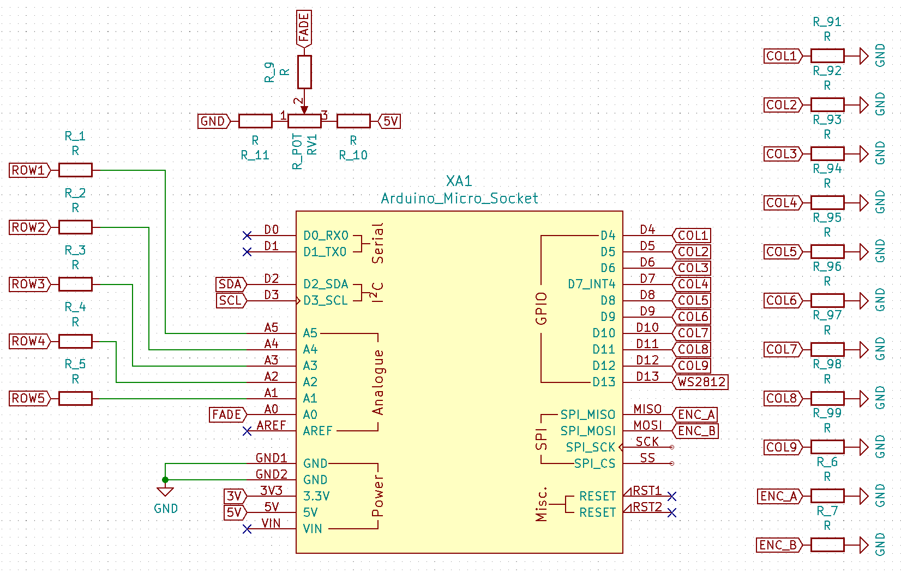
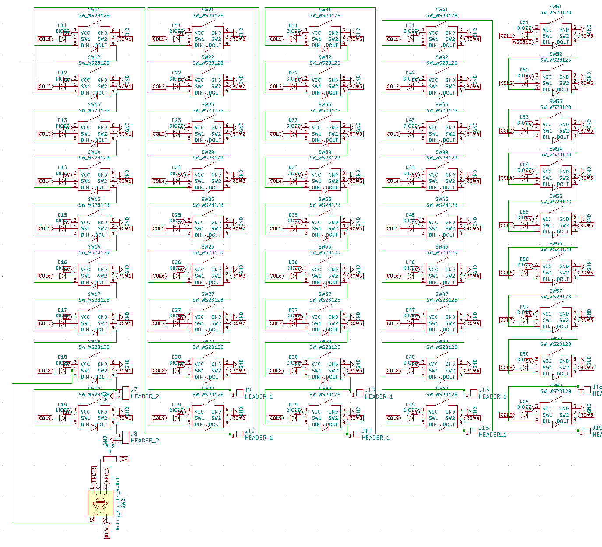

# Control-Panel Button Matrix

The Control Panel consists of two Button Matrix Boards, connected via USB to a Raspberry PI as well as a Touchscreen and some miscalaneous electronics such as fans and a power supply.

The Button Matrix has at most 5 rows of 9 buttons each and can be cut so that it is 5x8. Each button has a WS2812b LED assigned to it.

The buttons and LEDs are numbered from the top left, row by row.

This means that the top left button has the number 11 (first row, first button), the last button of this row has the number 19.
The first button in the last row has the number 51, the last one 59. In the communication protocol, the ws2812b LEDs are also addressed by the button number.

The buttons might be populated or not, depending on the configuration required for the use case. If the button is not populated, the LED usually is also not populated, however the external addressing stays the same (meaning there is some calculation required.)

There are also some additional user inputs on the PCB, namely a push encoder and a linear slider.

The total addressing in the protocol is the following (the values are the range of values of the second byte, the value byte):

- 0 - System Messages (0 = startup, 255 = unit/connection will shutdown)
- 1 - LED Brightness Bright (0-255 for dark to bright)
- 2 - LED Brightness Dark (0-255 for dark to bright)
- 9 - Encoder Turn (1 = Left Turn, 2 = Right Turn, Encoder Push is the same contact as button 58)
- 10 - Linear Slider (0-255 for 0v to 5V)
- 11 - Row 1 Button/LED 1 (for button: 0 = not pressed, 1 = pressed, for LED: one byte containing two sets of colors)
- ...
- 19 - Row 1 Button/LED 9 (...)
- ...
- 59 - Row 5 Button/LED 9 (...)

# Communication Protocol

The Communication Protocol uses UART and the first Byte in a Message defines the entity as described above.
When the Device starts up, it sends a Zero-Byte. Messages where the first byte is zero are system messages.

## Event-Messages from PCB to Master (Buttons and Faders)

when sending input messages, such as button presses or fader value changes, the first byte is the address, the second one is the state, such as 0 or 1 for a button (0 = not pressed, 1 = pressed) or 0-255 for a fader (where the range of the fader is mapped to 0-255).

The Encoder, if populated also can send messages. If it turns left, the message is 1 (per click), for right it is 2.
The push of the encoder is the same as button number 58

## Event-Messages from Master to PCB (LED status change, Brightness)

The master might also send messages to the controller, containing LED states.
The value of the led states is as follows:

ON R | ON G | ON B | BLINK R | BLINK G | BLINK B | BLINK FAST=1/SLOW=0 | DIM BRIGHT=1/DARK=0

the led needs to change color 4 times a second, if blink=fast, two times a second if blink=slow. It changes from the color from he first three bits to the one of the last three bits.
The Color is always mapped from bit to byte => 0 = 0x00 and 1 = 0x01 \* global brightness

Thus the brightness is determined by the globally set brightess, which is set by a message on address 1 (or 2 if the last bit of the led value is set to 0 and thus its meant to be a dark glow)

# Connections

For the connection diagram see

Note that the Diodes are Placed in reverse order to the Circuit.
So the Rows are the Output, which are set to high and the columns are the inputs, which can be read (High = Pressed, Low = Open)
